# 1701QCA Final Project Journal: Frank Blokdijk

## Related projects ##
*Find about 6 related projects to the project you choose. A project might be related through  function, technology, materials, fabrication, concept, or code. Don't forget to place an image of the related project in the appropriate folder and insert the filename in the appropriate places below. Copy the markdown block of code below for each project you are showing.*

### Related project 1 ###
*Get Started With Zip Halo for the BBC Microbit*

*https://www.kitronik.co.uk/blog/get-started-with-zip-halo/*

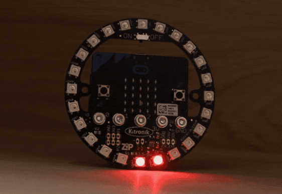

This project is related to mine because it explains how to use the halo with the BBC micro bit and explains the code used to make it work.

### Related project 2 ###
*Creating a compass*

*https://www.element14.com/community/community/stem-academy/microbit/blog/2019/05/15/6-lesson-plans-for-zip-halo-for-bbc-microbit

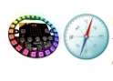

This project is related to mine because it shows how to use the functions of the microbit itself to influence the halo lights.

### Related project 3 ###
*Kitronik ZIP Halo Coaster*

*https://www.digikey.com.au/en/maker/projects/kitronik-zip-halo-coasters-using-microbit/09d20d98e9d9484aa3625060a06e166d*

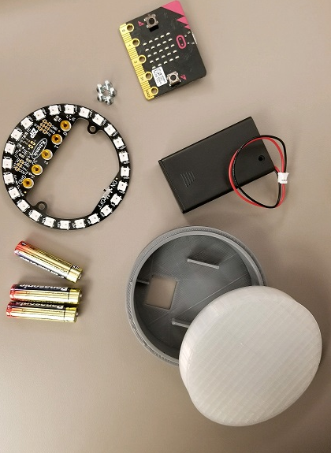

This project is related to mine because it further explains the physical dimensions and use of the halo, as well as explaining the code used to further take advantage of the use cases of the halo.

### Related project 4 ###
*Rainbow - Variable Speed (using 24 halo led from Kitronik)*

*https://makecode.microbit.org/v0/73871-88095-41756-70480*

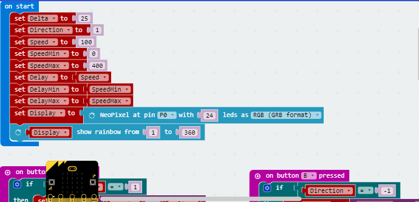

This project is related to mine because it shows the specific code used to make the halo display a variable speed light, which is incredibly important to mine.

### Related project 5 ###
*Kitronik ZIP Halo for the BBC micro:bit - MicroPython Examples*

*https://smalldevices.com.au/blogs/resources/kitronik-zip-halo-for-the-bbc-micro-bit-micropython-examples*

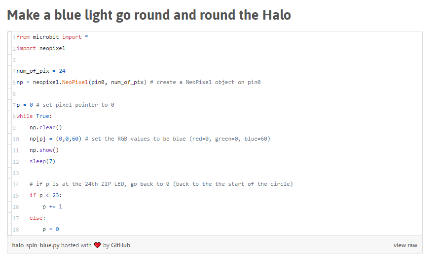

This project is related to mine because it shows the code needed to make a light go around the halo, which is step 1 for my build.

### Related project 6 ###
*Coding A Game*

*https://www.element14.com/community/community/stem-academy/microbit/blog/2019/05/15/6-lesson-plans-for-zip-halo-for-bbc-microbit*

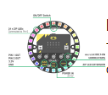

This project is related to mine because it shows how to code and create your own game with the microbit and halo together.

## Other research ##

### What is the framework for innovation? Design Council's evolved Double Diamond
 ###

https://www.designcouncil.org.uk/news-opinion/what-framework-innovation-design-councils-evolved-double-diamond

Design Council’s Double Diamond clearly conveys a design process to designers and non-designers alike. The two diamonds represent a process of exploring an issue more widely or deeply (divergent thinking) and then taking focused action (convergent thinking). I was able to use this approach to further the design of my project.

### Advanced Games with Micro:Bit ###

https://medium.com/@wtr/advanced-games-with-micro-bit-part-1-1cd1f33cd18b

This source allowed me to see the full breadth of what is achievable with the micro-bit, allowing me to extend my knowledge and create an item that is interesting and complex.

### Cyclone A timeless, intuitive game that no arcade should be without. ###

https://www.icegame.com/category/93/cyclone

The official page for the cyclone arcade machine, it gave me an insight into how the actual machine operates, and allowed me to replicate its general idea through the design of the original.

### Designing Distraction: Executive Toys ###

https://www.nytimes.com/2015/02/05/garden/designing-distraction-executive-toys.html

An article by the New York Times that outlines how executive toys are created and what makes them effective. An interesting read about how executive toys help executives stay focused and get out of complex situations.

## Conceptual Development ##

### Design intent ###

Objects that enhance the users ability to remain focused.

### Design concept 1 ###

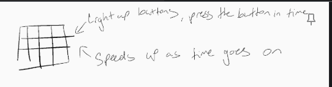

My first design concept was an array of buttons that light up randomly, in the style of 'whack-a-mole' where the intent is to press them when they light up. The individual would have three misses, if they miss three lights then the vibration motors in the body would buzz, and the lights would flash red, indicating that the player has lost. Personally, I like this idea, as I'm a very visual person when it comes to design and in particular my design intent, however, the feasability of buying this many light up buttons means that I'm unable to do this project as it currently stands. 

Which brings us to:

### Design concept 2 ###

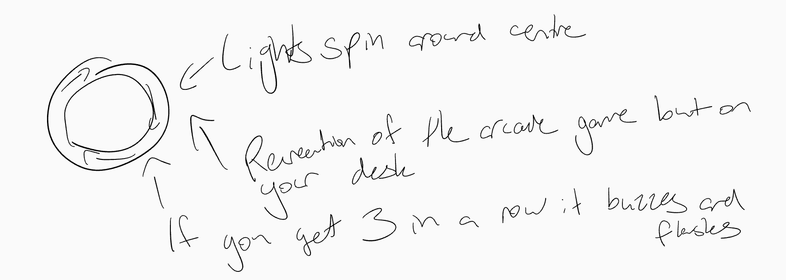

My second design concept is using the microbit 'halo', it's an iteration of the classic arcade game 'cyclone'. A single light spins around the centre at random speeds, and the objective is to catch the light as it goes past the button. Similar to the prior concept, the individual would have three misses, if they miss three lights then the vibration motors in the body would buzz, and the lights would flash red, indicating that the player has lost. I like this idea, however after speaking to David about it, we found a more interesting way to make this project come to life in terms of its interaction.

Which brings us to the final design concept:

### Final design concept ###

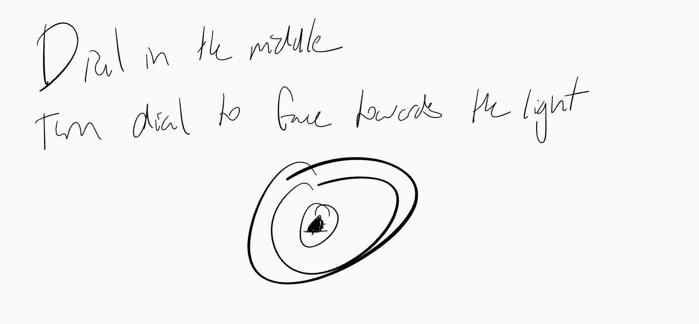

My final design concept is a different version of the classic cyclone machine, where now instead of trying to 'catch' the light with the button, the light will occasionally stop, and at this time the user will need to turn a dial to face the light. Same as the prior two designs, the individual would have three misses, if they miss three lights then the vibration motors in the body would buzz, and the lights would flash red, indicating that the player has lost.

The product will be made of wood, with a clear acrylic plate over the lights so the user can see them. My desk at home is made of wood, hence the use of wood in the creation of this product. I have a woodworking shed at my house, so the shell of the product will be made there.

### Interaction flowchart ###

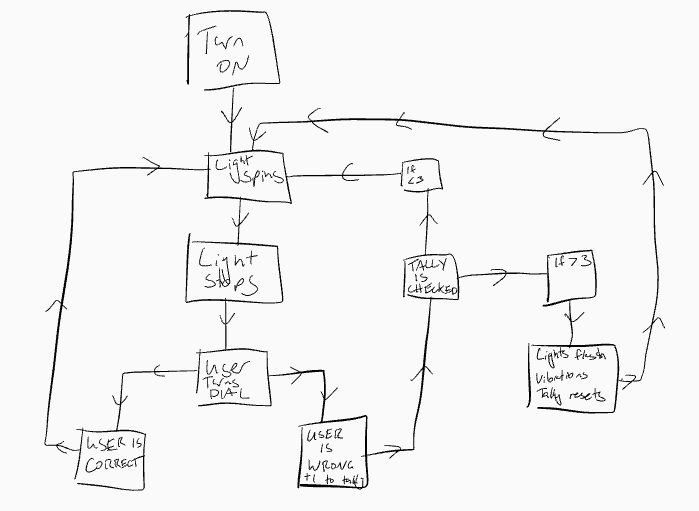

## Process Documentation ##

I started work with the code, starting with a simple code that allows me to get the light to spin around the neopixel.

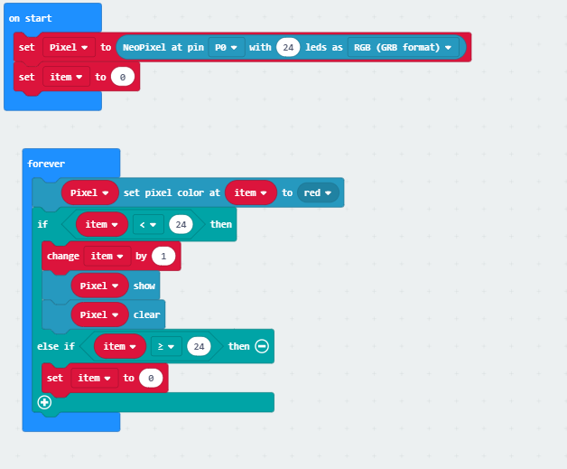

I've set the variable Pixel to the input of the Halo and managed to get the light to 'spin' on the test area on the left. Which you can see below:

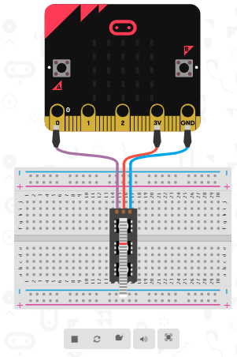

At this point in the process, I had to figure out two things, one, I need to find a way to make the light stop at random intervals. I've managed to get it to stop consistently by using the pause function, however this causes the game to have a pattern, which is against the initial point of the device in the first place. I'm currently experimenting with the 'pick random' function, however am not far enough in my research to show any working code with that in place.

Two, I'm also trying to work out how to put a dial in the centre of my device. I want to use a potentiometer, however I have VERY little knowledge on them, so am going to have to do some research!

At this point, this is where I'm at with my code, I can get the light to spin around the Halo, but can't get it to stop randomly OR find a way to get a dial working as of yet. However, I'm sure with further research I'll be able to get there.

At this point I have drawn up figures of how I imagine my final product looking, which I have attached below:

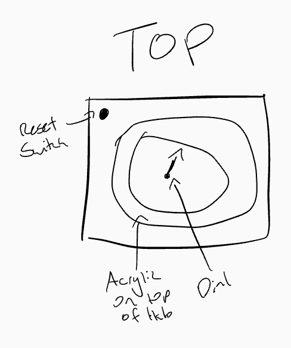

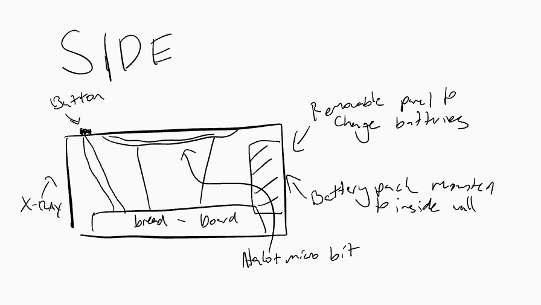

After careful consideration, I've made the decision to make the final product out of wood. This decision was made, mostly because it's what I have available to me. However, it's also an aesthetic decision, due to the fact that my desk is made of wood! Which means that an object also made of wood would fit right in.

At this point, I made the decision to entirely scrap the code that I had, as I realised that it absolutely wasn't correct for what I was doing. So, using the basis of the prior code above, I reworked it. Setting variable to pick random numbers from 1-24, and putting in a check statement that finds whether or not the NeoPixel light is on that value, after doing a full rotation anywhere from 2 to 4 times. 

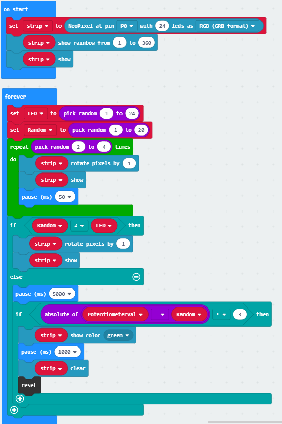

I also mapped the potentiometer values from the potentiometer from it's default 0-1023 to 1-24, so that the angle of the potentiometer is now directly proportionate to the amount of lights on the neopixel.

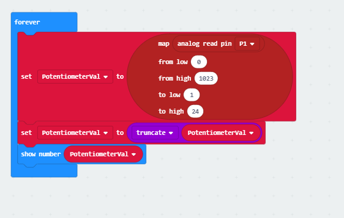

Now that I know the code works, I wired it up, and tested it. And was happy to see that the potentiometer works PERFECTLY, and whenever I see all those lights turn green it is INCREDIBLY satisfying. The feeling of playing with it was enough for me to know that this was a good project, because I myself was getting distracted by it.

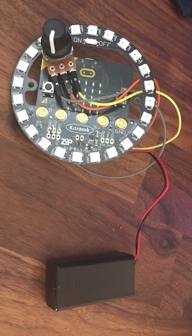

Now that the projects code works and I've figured out the wiring for it, I can start thinking about how the project is going to fit together. I knew that I wanted a wooden box, but I now have to measure it out, and work out the dimensions of the box. I drew a square around the box, added 20mm for the width of the wood, and measured it out.

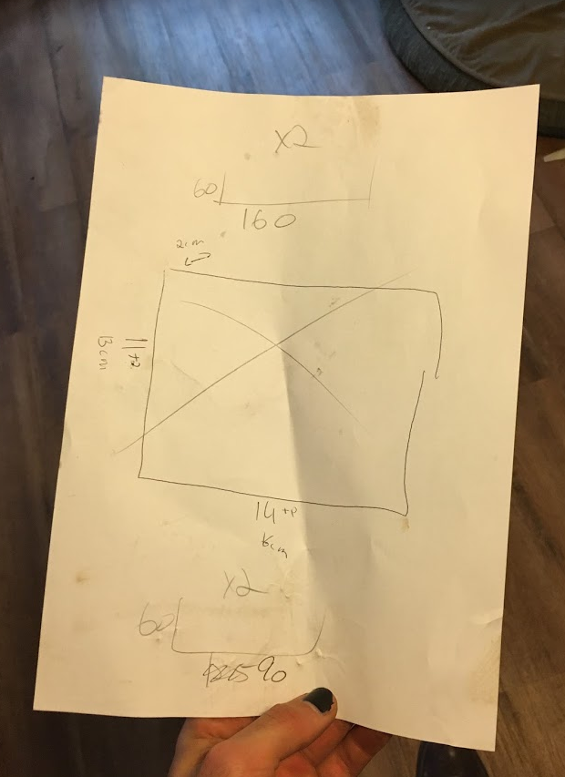

I then got to work, cutting everything out and fitting it together. I did a dry fit to see if it all works together. I made a perfect cut out in the top of the box, that holds the Neopixel perfectly with no added support or glue. After the dry fit I was absolutely thrilled! 

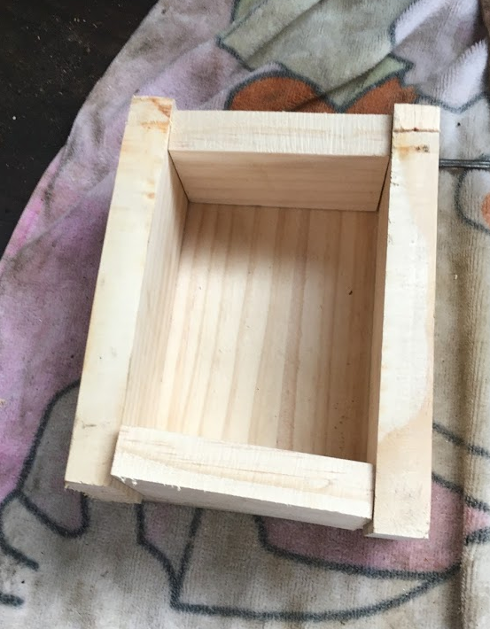

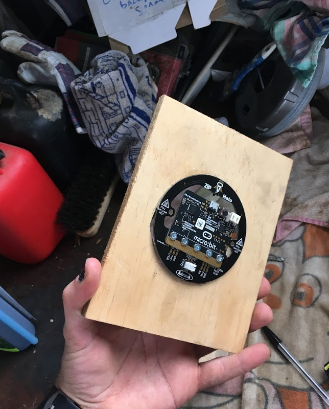

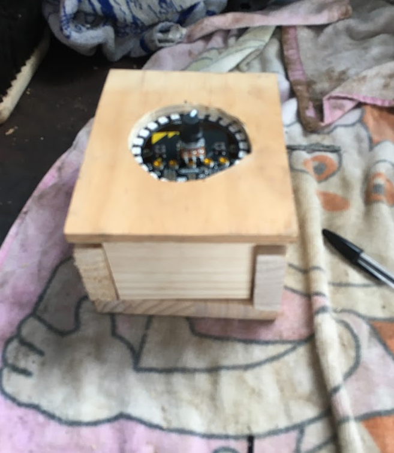

Now that I know the dry fit works, I can put everything together permanently! I glued the top panel and sides together, and added a hinge and clasp on the bottom, so it can be opened to replace the batteries and take out the microbit. The final design is finished! 

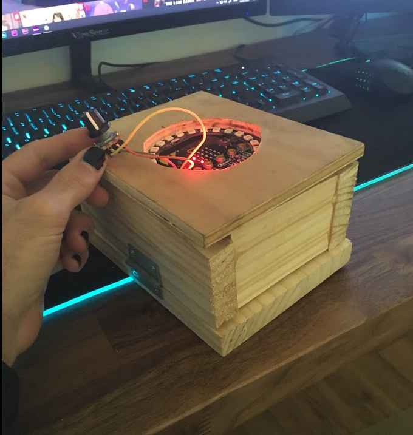

## Final Code ##

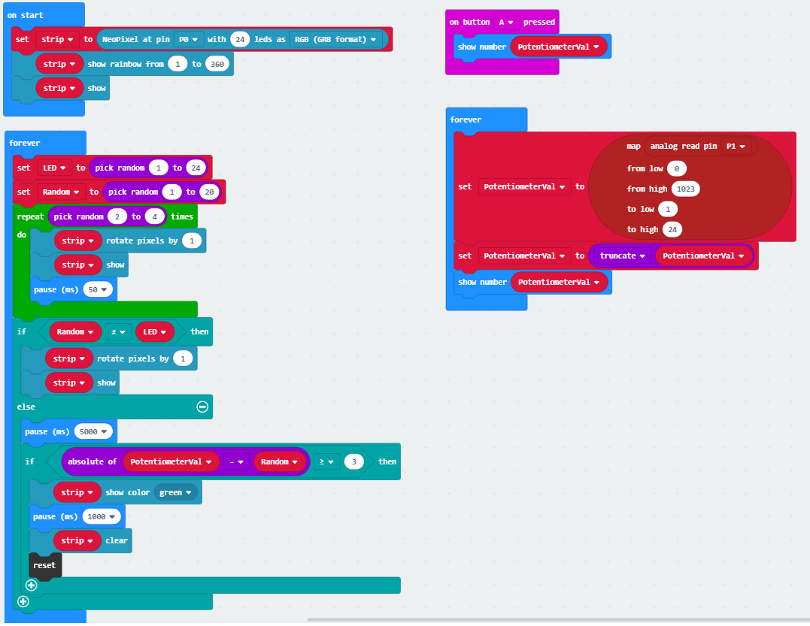

## Design process discussion ##

I've found the design process rather difficult actually, this comes from the fact that I'm the kind of person with ideas that are far too large for the practicality of what I can actually accomplish. So having to bring my ideas down and simplify them has been a difficult process for me.

However, in terms of the idea itself, it's one that I've had for quite some time. So it came rather easily in that sense. It was the simplifying it and bringing it down to size that I found rather difficult. 

In designing the product itself, I personally like the boxier, rustic aesthetic a lot. So I found that I could combine the two aesthetics of light up, electronics with the rustic exterior of a wooden box, and I really like that idea! It reminds me a lot of the useless switch boxes that turns themselves off when you turn them on.

## Reflection ##

<!--- Describe the parts of your project you felt were most successful and the parts that could have done with improvement, whether in terms of outcome, process, or understanding.

I feel that both my code and choice of physical parts were the most successful parts of this build. It made for an effective and engaging product that kept my attention. However, I would love to improve on a few things if I were to make a second version, in particular the aesthetics of the box, as well as properly soldering the wires so that they are unable to fall or be knocked off. While it works in it's current state and is robust enough to work, it could always use more work.

As for resources and information that I used from other sources, I used many of the skills I learned from the basic NeoPixel tutorials. As well as using the basis from the tutorials to get the NeoPixel to spin. However, in the end I ended up creating my own script from scratch, as it worked better for my idea. Ultimately, I didn't end up using any of the information from the other sources I researched, however I was absolutely influenced by the ideas that I had researched.

I went for both a new method or interfaces for interaction as well as a new form that recontextualises existing work. I took the idea of the original cyclone arcade machine and recontextualised it for a desk setup that allows the individual to be kept busy. I also found a new method of interaction, in the way of using the dial rather than a button. I found that the dial had a far more tactile feeling as opposed to a button, which is why I made the change.

Further extensions of the project include making it smaller and more compact, more of a desk toy and less of a desk chest. Furthermore, using this dial and NeoPixel combination could be used as a volume dial, brightening the lights and dimming them as the volume increases and decreases. This combination of electronics can be used for a wide range of projects, ranging from practical to impractical. Therefore, I feel that this is an incredibly diverse project, allowing for projects such as a volume knob, light switch, a wide array of games and much, much more.

Ultimately, I was very happy with how my project came out. I'm incredibly proud of the code that I made. However, in future I would like to spend more time on the physical ideation of the box, making it more physically appealing. 
